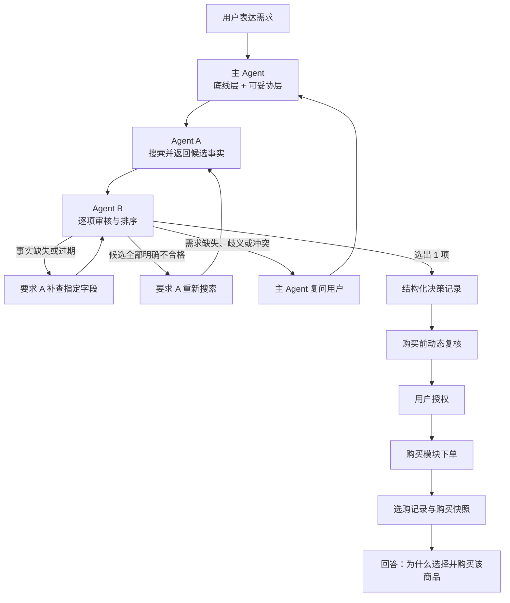

# Agent B 完整职责与数据契约设计

> 实现进展：契约版 B 核心与可注入 A 的编排器已加入，入口与待统一字段见 [Agent B 实现交接](agent-b-implementation.md)。下文“现有/规划”保留设计时基线；实际完成范围以交接文档为准。旧网页尚未切换新版，真实数据源、日志持久化和购买执行需由对应模块接入。

本文档定义 Agent B 在购物 Agent 中的职责、输入、输出、审核规则、失败后的回流方式，以及下单后的决策追溯方案。它面向主 Agent、Agent A、购买模块、前端和测试人员。

> 对齐基准：`shopping-contract-template(1).mjs` 中的 `proposal-v1`。该文件是联调提案，不是仓库中已经生效的类型或实现。本文标记“现有”的能力已经由当前代码支持；标记“契约增量”或“B 需求”的内容仍需团队共同修改公共类型、主 Agent、A、B、表单和运行时校验。

## 0. 最新契约对齐结论

ShoppingPort 边界统一接收 `{ requirement, quantity }`；主 Agent/编排层调用 B 时再附加 A 的候选，即 `{ requirement, quantity, candidates }`。`quantity` 位于 Requirement 外层，不重复写入 `Requirement`。`budget.scope` 的 `item` 和 `delivered` 都针对本次 `quantity`，因此本文不再引入 `budget.appliesTo`。

本轮采用以下统一语义：

| 项目 | 统一结果 |
| --- | --- |
| 条件结果 | 对外使用 `match / mismatch / unknown`；内部旧代码的“通过/拒绝/未知”需要适配 |
| 硬约束关系 | `hardConstraints[]` 各项之间为 AND |
| 偏好关系 | 每个 `Preference.conditions[]` 组内为 AND；`containsAny` 的关键词数组内部为 OR |
| 偏好权重 | 正有限数且大于 0，表示相对权重，不要求合计为 1 或 100 |
| 数量 | `shoppingRequest.quantity`，表示购买销售单位数量，不等于套装内件数 |
| 预算 | 始终是硬上限，并且对应本次 `quantity` |
| 折扣 | `offer.discountMinor` 表示本次整笔已核实即时折扣，只扣一次 |
| 其他费用与总额 | 使用 `quote.otherFeesMinor` 和 `quote.totalMinor` |
| 报价上下文 | `quote.quantity` 和 `quote.destination` 必须与本次请求一致 |
| 时间 | 条件比较使用 UTC epoch 毫秒；`Fact.fetchedAt` 继续使用 ISO 8601 |
| 演示数据 | `dataEnvironment: "development_mock"`；只能生成明确标记的模拟结果 |
| ShoppingPort 状态 | `result_ready / no_match / needs_verification / failed` |

类别 `requirement.category` 本身是硬条件，不要求商品标题出现完全相同的文字。`query` 只服务于召回，不能替代结构化硬约束和偏好条件。

## 1. Agent B 的定位

Agent B 是**候选审核与决策收敛模块**。它不搜索商品、不修改用户需求、不维护共享状态，也不执行真实购买。

Agent B 接收主 Agent 整理后的 `{ requirement, quantity }` 和 Agent A 返回的 `candidates`，内部评估输入为 `{ requirement, quantity, candidates }`，依次完成：

1. 检查任务和需求版本，拒绝使用旧需求结果。
2. 检查币种、预算、库存、配送、渠道白名单、异常低价和其他硬约束。
3. 将每项检查记录为 `match`、`mismatch` 或 `unknown`。
4. 对通过底线审核的候选，按“可妥协层”的偏好进行排序。
5. 默认收敛为 1 个最终选择，并记录选择理由、取舍和其他候选未入选原因。
6. 无法完成决策时，指出应该由 A 补查、A 重新搜索，还是由主 Agent 向用户追问。
7. 在购买前重新检查动态事实和后端授权。
8. 生成可追溯的结构化决策记录，供用户下单后查询“为什么选择了这个商品”。

Agent B 的“通过”只表示通过选品审核，不等于获得购买授权，也不等于订单已经提交。

## 2. 模块边界

| 模块 | 负责 | 不负责 |
| --- | --- | --- |
| 主 Agent | 理解对话、区分底线层与可妥协层、维护 `requirementVersion`、调度 A/B、向用户追问、保存任务事件 | 编造商品事实、越过用户同意放宽硬约束 |
| Agent A | 搜索、召回、去重、字段归一、来源记录、指定事实补查 | 最终选品决策、擅自修改需求、购买授权 |
| Agent B | 硬条件审核、风险检查、偏好排序、收敛选择、补查/搜索/追问建议、决策记录、购买前检查 | 搜索商品、直接改变共享状态、执行下单 |
| 购买模块 | 查询后端授权、保存购买快照、提交订单、记录结果 | 重新解释需求或替代 B 做选品 |
| 日志/存储层 | 追加保存需求、事实、决策、授权和订单事件 | 修改已经发生的历史事件 |
| 前端 | 展示审核结果、推荐理由、取舍、待补信息和选购记录 | 将 `unknown` 显示为已通过，将推荐显示为购买批准 |

## 3. 整体流程



自动补查和重新搜索必须设置轮数上限。如果连续一轮没有产生新事实或改变审核结果，应停止循环并返回未解决原因。

## 4. 审核原则

### 4.1 三态判断

每条审核规则只能得到以下状态之一：

| 状态 | 含义 | 后续处理 |
| --- | --- | --- |
| `match` | 有未过期、来源合格的事实证明满足规则 | 可以继续下一项审核 |
| `mismatch` | 有事实证明不满足规则 | 候选被拒绝，并记录原因 |
| `unknown` | 字段缺失、未核验、为 Mock、已过期或相互矛盾 | 不能作为已通过候选；根据原因补查或追问 |

`null` 表示未知，不能使用 `0`、空字符串或系统猜测替代。Mock 数据可以用于明确标记的演示流程，但不能作为真实推荐和购买批准的证据。

### 4.2 底线层与可妥协层

- **底线层**：类别、预算上限、币种、库存、配送、渠道白名单以及用户明确表示“必须”“不能”的条件。任何一项 `mismatch` 都会淘汰候选；任何一项 `unknown` 都会阻止其成为最终已核验选择。
- **可妥协层**：用户用“更喜欢”“优先”“最好”等方式表达的条件。它们只用于合格候选之间的排序，不得抵消底线失败。
- 主 Agent 必须记录条件来源是 `explicit` 还是 `inferred`。推断条件不能自动升级为硬约束。
- `allowAlternativeProducts: true` 只允许选择其他商品，不允许放宽类别、品牌、色号、预算等任何硬条件。字段缺失时不得推断用户允许替代指定商品。
- 文本条件只证明 `text.searchable` 是否出现某些词，不能据此证明成分、功效、真伪或个体适用性。

## 5. Agent B 的审核顺序

建议按下列固定顺序执行，先处理成本低、判定明确的规则，再进行偏好评分：

| 顺序 | 检查项 | `match` 条件 | `mismatch` 示例 | `unknown` 时的动作 | 当前状态 |
| --- | --- | --- | --- | --- | --- |
| 1 | 身份与版本 | `taskId`、`requirementVersion` 和商品身份有效 | 结果属于旧需求版本 | 主 Agent 重新提供当前快照 | 部分现有 |
| 2 | 类别 | `attributes.category` 与 `requirement.category` 标准化后匹配 | 明确属于其他类别 | A 补查类别 | 契约增量 |
| 3 | 用户排除 | 商品不在排除列表 | 用户已排除该商品 | 主 Agent 澄清排除范围 | 现有 |
| 4 | 币种 | 报价币种与预算币种一致 | HKD 预算对应 USD 报价 | A 补查报价币种 | 现有 |
| 5 | 预算 | 与本次数量和地区绑定的金额不超过上限 | 到手总价超过预算 | A 补查价格、运费、折扣、其他费用或总额 | 现有计算需修正 |
| 6 | 库存 | 可履约本次 `quantity` | 缺货或数量不足 | A 补查库存数量或商户履约能力 | 字段不足 |
| 7 | 配送 | 可送达 `destination`，并满足明确期限 | 不可配送或超过硬性期限 | 缺商品事实找 A；缺目的地问用户 | 现有，期限需扩展 |
| 8 | 渠道白名单 | 商户身份符合当前策略 | 商户已确认不在白名单 | A 核验商户；配置缺失交给系统维护方 | B 需求 |
| 9 | 异常低价 | 未触发阈值，或触发后已取得足够证据放行 | 复查确认规格错误或优惠不可用 | A 专项复查价格、规格、商户和优惠 | B 需求 |
| 10 | 其他硬约束 | 每个 Constraint 均为 `match` | 明确违反容量、包装、色号等条件 | 商品事实找 A；需求含义不清问用户 | 操作符需扩展 |
| 11 | 偏好排序 | 记录每组偏好的 `match/mismatch/unknown` | 不产生硬性淘汰 | 补查可能改变排名的字段 | 评分器需重构 |

### 5.1 预算计算

按照 `proposal-v1`，B 优先使用与本次数量和地区绑定的 `quote.totalMinor`。其统一计算语义为：

```text
itemSubtotalMinor = itemPriceMinor * quantity
itemBudgetAmount = itemSubtotalMinor - discountMinor
deliveredBudgetAmount = itemSubtotalMinor
+ shippingMinor
+ quote.otherFeesMinor
- discountMinor
```

所有金额均使用整数最小货币单位。`itemPriceMinor` 是一个销售单位的价格；`shippingMinor`、`discountMinor` 和 `quote.otherFeesMinor` 都对应本次整笔报价，只计算一次。`budget.scope: "item"` 使用 `itemBudgetAmount`，`"delivered"` 使用 `quote.totalMinor` 或等价的 `deliveredBudgetAmount`。

只有确认适用的即时优惠才能进入计算。确认无优惠时填写已核验的 `0`；未知填写 `null`。未来返现、积分估值和未确认优惠不能扣除。任何必要费用未知时，总额就是 `unknown`，不能用价格偏好替代硬预算检查。

当前实现使用：

```text
(itemPriceMinor - discountMinor) * quantity + shippingMinor
```

当前公式把整笔折扣乘以了数量，并且没有 `quote.otherFeesMinor`，与最新契约不一致，必须在 B 实现中修正。最新契约已经明确预算对应本次 `quantity`，不增加 `budget.appliesTo`。

### 5.2 异常低价规则

异常低价是风险复查触发器，不直接等同于假货或淘汰理由。建议初始规则如下：

1. 优先比较同一 `productId + skuId`、同规格、同市场、同币种的近期报价。
2. 基准使用可信渠道报价的中位数，排除 Mock、当前待评估报价和已知异常值。
3. 至少需要 5 个有效报价、3 个独立卖家，默认统计最近 7 天。
4. 候选单件确认优惠后价格低于中位数的 50% 时，标记为 `needsVerification`。
5. A 需要复查规格、数量、正装/小样、商品状态、卖家身份、优惠资格和实际可购买性。
6. 样本不足时记录 `benchmark_insufficient`。它本身不淘汰商品，但不能声称价格已经通过异常低价检查。

阈值、样本量和时间窗口必须放入系统配置并带 `policyVersion`，后续再根据真实数据校准。

## 6. 主 Agent 必须提供给 B 的字段

下表包含现有字段和规划字段。规划字段名称是接口草案，实施时以 `types/index.ts` 为唯一类型来源。

| 字段 | 类型/示例 | 必要性 | 用途 | 状态 |
| --- | --- | --- | --- | --- |
| `taskId` | `string` | 必需 | 关联同一次购物任务 | 现有 |
| `requirementVersion` | 非负整数 | 必需 | 防止旧结果覆盖新需求 | 现有 |
| `quantity` | `1`，位于 ShoppingPort 顶层 | 必需 | 本次购买销售单位数；不能与套装内件数混淆 | 契约增量 |
| `category` | `"乳液"` | 必需 | 类别硬条件及召回范围 | 现有，B 尚未强制审核类别 |
| `query` | 用户需求摘要 | 必需 | 保留搜索语义 | 现有 |
| `currency` | `"HKD"` | 必需 | 币种一致性检查 | 现有 |
| `budget.maxMinor` | `50000` | 必需 | 预算上限 | 现有 |
| `budget.scope` | `item / delivered` | 必需 | 均对应本次 `quantity` | 现有，旧计算需适配 |
| `destination` | `"香港"` | 本轮 MVP 必需 | 最小配送地区；不发送详细宿舍地址 | 现有字符串 |
| `allowAlternativeProducts` | `boolean` | 可选 | 是否允许换其他商品；不能放宽硬条件 | 契约增量 |
| `hardConstraints[].id` | 稳定字符串 | 可选但强烈建议 | 将审核结果和日志关联回原条件 | 契约增量 |
| `hardConstraints[].field` | 如 `attributes.volumeMl` | 必需 | 指向规范字段 | 现有 |
| `hardConstraints[].op` | 增加 `containsAny / notContainsAny` | 必需 | 硬条件运算 | 契约增量 |
| `hardConstraints[].value` | 数值、布尔、字符串或字符串数组 | 必需 | 目标值；色号 `"02"` 保持字符串 | 现有 |
| `preferences[].id` | 稳定字符串 | 可选但强烈建议 | 关联偏好检查和日志 | 契约增量 |
| `preferences[].field` | 用于标识偏好主题 | 必需 | 兼容现有结构 | 现有 |
| `preferences[].weight` | 正有限数，如 `2` | 必需 | 相对权重，不要求合计为 1 | 现有校验需改变 |
| `preferences[].source` | `explicit / inferred` | 必需 | 标记用户明示或系统推断 | 现有 |
| `preferences[].conditions` | `Constraint[]` | explicit 偏好必需 | 组内 AND；不能从旧 `field` 猜目标 | 契约增量 |
| `excludedProductIds[]` | 商品 ID 列表 | 可为空 | 用户明确排除 | 现有 |

主 Agent 内部继续保存 intent、完整用户草稿和对话，但不向 Shopping/B 发送完整用户档案、支付信息或详细住址。`query` 由主 Agent 根据已有需求生成，不要求用户重复填写。任何有效条件变化都必须递增 `requirementVersion`。

旧偏好如果没有 `conditions`，适配层只能保留为明确可解释的旧规则或返回 `INVALID_INPUT`，不能由 B 猜测“高更好”“低更好”或目标范围。

## 7. Agent A 必须提供给 B 的字段

### 7.1 商品与报价身份

| 字段 | 必要性 | 说明 | 状态 |
| --- | --- | --- | --- |
| `productId` | 必需 | 产品型号/基础商品身份 | 现有 |
| `skuId` | 进入最终选择前必需 | 具体规格、容量、色号等 | 现有，可为 `null` |
| `offerId` | 进入最终选择前必需 | 具体卖家和销售方案 | 现有，可为 `null` |
| `title`、`url` | 必需 | 展示和追溯来源 | 现有 |
| `attributes` | 按品类要求 | 规格、成分、重量等事实 | 现有 |
| `attributes.category` | 必需 | 类别硬条件 | 契约增量样例已定义 |
| `text.searchable` | 使用文本条件时必需 | 执行 `containsAny / notContainsAny` | 契约增量 |
| `merchant.id` | 渠道审核必需 | 精确识别商户 | 契约增量 |
| `merchant.name` | 建议必需 | 展示商户并保留事实来源 | 契约增量 |
| `missingFields[]` | 可为空 | 明确告知尚未获取的字段 | 现有 |

### 7.2 报价与履约字段

| 字段 | 必要性 | B 的用途 | 状态 |
| --- | --- | --- | --- |
| `offer.currency` | 必需 | 币种检查 | 现有 |
| `offer.itemPriceMinor` | 必需 | 单个销售单位价格 | 现有 |
| `offer.shippingMinor` | `delivered` 预算必需 | 本次数量和地区对应的整笔运费 | 现有，语义需明确 |
| `offer.discountMinor` | 必需 | 本次整笔已核实即时折扣，只扣一次；未知为 `null` | 现有，旧计算不一致 |
| `offer.stock` | 必需 | 是否有货 | 现有 |
| `offer.deliverable` | 有目的地时必需 | 是否可配送 | 现有 |
| `quote.quantity` | 必需 | 必须等于请求顶层 `quantity` | 契约增量 |
| `quote.destination` | 必需 | 必须与需求配送地区一致 | 契约增量 |
| `quote.otherFeesMinor` | `delivered` 预算必需 | 本次其他适用费用；确认无费用才为已核验 0 | 契约增量 |
| `quote.totalMinor` | `delivered` 预算必需 | 与数量和地区绑定的到手总额 | 契约增量 |
| `quote.estimatedDeliveryAtMs` | 用户有截止时间时必需 | UTC epoch 毫秒到货承诺 | 契约增量 |

### 7.3 每项事实的元数据

动态和静态字段都应使用 `Fact<T>` 或等价结构提供：

| 字段 | 含义 |
| --- | --- |
| `value` | 事实值；未知使用 `null` |
| `source` | URL 或数据源标识 |
| `fetchedAt` | ISO 获取时间 |
| `status` | `verified / unverified / mock` |
| `validUntil` | B 仍建议增加；数据源有效期或按策略计算的截止时间，最新模板暂未包含 |

为了执行异常低价检查，A 或独立价格基准服务还需返回：可比范围、规格、币种、中位价、样本量、独立卖家数、统计窗口、来源和获取时间。

`quote` 必须作为一个一致的报价快照。请求的数量或地区发生变化时，A 必须重新计算，B 不复用旧 `quote.totalMinor`。如果 `quantity > 1`，仅有 `offer.stock: "available"` 不足以证明能够履约，A 还需提供可售数量或明确的商户履约结论；该字段在最新模板中尚未定名，是 B 需要向团队提出的契约需求。

文本统一进行 NFKC 和大小写归一后再匹配。`notContainsAny` 遇到缺失文本时必须返回 `unknown`，不能当作“没有命中”。

## 8. 系统配置提供给 B 的字段

这些字段由开发、运营或服务配置维护，不向购物用户索取。

| 字段 | 作用 |
| --- | --- |
| `channelAllowlist` | 允许的平台、卖家、卖家类型及精确匹配标识 |
| `policyVersion` | 标记本次审核采用的规则版本 |
| `lowPriceRatio` | 异常低价阈值，初始建议 `0.5` |
| `benchmarkMinOffers` | 有效报价最少数量，初始建议 5 |
| `benchmarkMinSellers` | 独立卖家最少数量，初始建议 3 |
| `benchmarkWindowMs` | 价格基准统计窗口，初始建议 7 天 |
| `factFreshnessPolicy` | 价格、库存、配送和静态属性各自的有效期 |
| `maxVerificationRounds` | 补查轮数上限，初始建议 2 |
| `maxSearchRounds` | 补充搜索轮数上限，初始建议 2 |
| `rankingPolicy` | 偏好评分、缺失值和平局规则 |
| `demoMode` | 是否允许生成明确标记的演示选择；不得用于真实购买 |

## 9. Agent B 的输出字段

最新统一模板规定 ShoppingPort 对外只返回四种状态：

| ShoppingPort 状态 | 含义 | B/主 Agent 的处理 |
| --- | --- | --- |
| `result_ready` | 已有至少一个当前证据下合格的候选 | 返回推荐、候选和 diagnostics；Mock 必须明确标记 |
| `no_match` | 搜索成功，但候选为空或全部明确 `mismatch` | 主 Agent 可根据原因发起补充搜索或询问用户是否调整条件 |
| `needs_verification` | 没有已合格候选，但仍有可能合格的 `unknown` 候选 | 主 Agent 按 `verificationRequests` 调 A 补查 |
| `failed` | 全部数据源失败、超时或输入无效等任务失败 | 返回统一错误；不能包装为成功结果 |

搜索完整度 `complete / partial / failed` 放在 `diagnostics.searchStatus`，与最终推荐状态分开。部分数据源失败不阻止基于已有证据返回结果，但必须说明比较范围。

每个返回分支都必须回传 `taskId`、`requirementVersion` 和 `dataEnvironment`。`result_ready` 可以附带 `candidates`、`recommendations` 和 `diagnostics`；其他状态也可以附带候选和诊断，不能把 `no_match`、`needs_verification` 或 `failed` 统一伪装成 `result_ready`。

B 内部可以继续使用更细的调度原因，例如“需要重新搜索”“需要主 Agent 复问”“系统策略缺失”，但对外不能新增第五种 ShoppingPort 状态。团队需要在 `diagnostics.nextAction` 或等价字段中确定承载方式。

规划将 B 从“最多 3 个代表候选”调整为：内部可以保留多个候选和最多 3 个展示项，但 `recommendations[0]` 是 B 当前首选，并完整记录审核依据。是否最终只展示 1 项由主 Agent/产品层决定。

### 9.1 `recommendations[]`

推荐项与统一模板对齐，至少包含：

- `productId`、`skuId`、`offerId`；
- `rank`，从 1 开始；
- `evidenceStatus`，例如 `verified / unverified / mock`；
- `checks[]`，每条硬条件的 `conditionId`、`outcome` 和 `evidenceFields`；
- `preferenceChecks[]`，每个偏好条件组的结果和证据；
- `explanation` 和 `tradeoffs[]`；
- 偏好分数的下界和上界，字段名需要团队确定。

`checks[].outcome` 和 `preferenceChecks[].outcome` 使用 `match / mismatch / unknown`。`conditionId` 优先使用主 Agent 提供的 Constraint/Preference `id`；系统固有规则使用稳定 ID，例如 `category`、`currency`、`budget`、`stock`、`delivery`、`channel-allowlist` 和 `low-price-risk`。

### 9.2 偏好评分

最新模板规定 B 不再让 LLM 自由给 1–5 分，也不能只根据 `Preference.field` 猜测评分方向。每个偏好先执行 `conditions[]`：组内全部 `match` 才算该偏好匹配；任一 `mismatch` 则不匹配；没有 `mismatch` 但存在 `unknown` 时结果为未知。

建议按模板计算已证实分数区间：

```text
L = 100 * matchWeight / totalPreferenceWeight
U = 100 * (matchWeight + unknownWeight) / totalPreferenceWeight
```

没有偏好时不计算 L/U，按已核实的 `quote.totalMinor` 升序排列。存在偏好时先按 L 降序，再按可比较的已核实总额升序，最后按稳定的 `(productId, skuId, offerId)` 排序。不同币种没有已核实换算时不得直接比较。

分数区间重叠时，解释只能说“当前已证实条件下的首选”，不能声称必然优于其他候选。旧 `EvaluationRecommendation.score: number` 无法表达未知，应改成上下界或允许 `null`。

### 9.3 推荐数量

排序规则建议为：

1. 只在所有底线均为 `match` 的候选中排序。
2. 默认首选是 `recommendations[0]`；B 的决策日志记录为什么选它。
3. 可以保留少量备用或展示候选，服务端建议上限为 3，但它们不能被描述为同一个“最终选择”。
4. 如果前两名存在决定性取舍且用户没有给出必要偏好，B 在 diagnostics 中要求主 Agent 复问，不自行猜测。

“未选中”不等于“审核失败”。界面和日志必须区分 `rejected` 与 `not_selected`。

### 9.4 `diagnostics`

为支持主 Agent 调度和决策日志，B 需要输出或补充以下诊断字段：

| 字段 | 作用 |
| --- | --- |
| `searchStatus` | 保留 A 的 `complete / partial / failed` 搜索状态 |
| `countUnit` | 固定为 `offer`，按 `(productId, skuId, offerId)` 去重后计数 |
| `filterLogs[]` | 每个 `conditionId` 的输入、匹配、拒绝和未知数量 |
| `verificationRequests[]` | 指定商品身份、字段和补查原因 |
| `warnings[]` | 数据范围、Mock、部分来源失败和比较限制 |
| `nextAction` | B 需要团队确认的增量，用于表达 `verify / search / clarify / resolve_configuration / none` |

其中 `searchStatus` 由 A 提供，B 原样保留；条件检查、排序诊断和 `nextAction` 由 B 产生。主 Agent 根据这些字段决定是否补查、重搜或复问。

## 10. 未完成决策时的回流规则

| 场景 | 对外状态与 diagnostics | 主 Agent 的动作 |
| --- | --- | --- |
| 没有合格候选，价格、库存、运费、配送、商户身份或硬约束事实缺失/过期 | `needs_verification` + 精确 `verificationRequests` | 调用 A 的 `verifyFacts` 后重新评估 |
| 已有合格首选，但其他候选仍有未知 | `result_ready` + 未核验范围说明 | 可以展示首选，并按价值决定是否继续补查 |
| 异常低价触发且尚未放行 | `needs_verification` + 专项原因 | 要求 A 核查规格、商户、优惠和实际可购买性 |
| 候选为空或全部明确违反底线 | `no_match` + 原因/搜索提示 | 保持用户底线，让 A 搜索新的候选；仍无结果再询问用户 |
| 缺预算、数量、地区，或用户条件有歧义/冲突 | Shopping 调用前拦截，或 diagnostics 标记需澄清 | 主 Agent 向用户追问，更新需求版本 |
| 白名单、价格基准或策略配置缺失 | `failed` 或统一的配置阻塞诊断，具体承载待团队确认 | 交给开发/运营处理，不反复询问用户 |
| 达到补查上限或无新证据 | 保留实际状态并在 diagnostics 说明停止原因 | 向用户展示未解决项和可选下一步 |

B 不能自行放宽预算、删除用户底线或修改需求。用户同意改变条件后，由主 Agent 更新 `requirementVersion` 并重新启动流程。

## 11. 决策日志与下单后解释

### 11.1 B 负责生成决策记录

B 在选出商品时生成不可歧义的结构化 `DecisionRecord`：

```ts
type DecisionRecord = {
  decisionId: string
  taskId: string
  requirementVersion: number
  quantity: number
  dataEnvironment: "development_mock" | "production"
  selectedAt: string
  policyVersion: string
  selected: {
    productId: string
    skuId: string
    offerId: string
  }
  quoteSnapshot: {
    destination: string
    currency: string
    itemPriceMinor: number
    shippingMinor: number
    discountMinor: number
    otherFeesMinor: number
    totalMinor: number
  }
  reasons: {
    code: string
    message: string
    evidenceFields: string[]
  }[]
  hardConstraintChecks: {
    conditionId: string
    outcome: "match" | "mismatch" | "unknown"
    expected: unknown
    actual: unknown
    evidenceFields: string[]
  }[]
  preferenceChecks: {
    conditionId: string
    outcome: "match" | "mismatch" | "unknown"
    evidenceFields: string[]
  }[]
  tradeoffs: string[]
  alternatives: {
    productId: string
    skuId: string | null
    offerId: string | null
    outcome: "rejected" | "not_selected" | "needs_verification"
    reasons: string[]
  }[]
  scoreLowerBound: number | null
  scoreUpperBound: number | null
  rankingPolicy: string
}
```

B 只记录它实际使用过的事实。禁止在用户事后询问时重新编造理由，或把当前商品页面的数据当成当时的证据。

### 11.2 主 Agent 负责完整任务事件

主 Agent 或日志服务使用只追加事件记录串联全流程：

```ts
type TaskEventType =
  | "requirement_created"
  | "requirement_updated"
  | "candidates_searched"
  | "facts_verified"
  | "candidate_evaluated"
  | "candidate_selected"
  | "purchase_checked"
  | "user_authorized"
  | "order_submitted"
  | "order_completed"
  | "order_failed"
```

每条事件至少包含 `eventId`、`taskId`、`requirementVersion`、时间、执行方和结构化载荷。历史事件不覆盖，只追加纠正事件。

### 11.3 购买模块负责下单快照

购买模块在下单前后保存：

- `decisionId` 和 `authorizationId`；
- 最终 `productId / skuId / offerId`；
- 数量、币种、商品小计、运费、其他费用、优惠和最终总价；
- 下单时库存、配送地摘要、平台及卖家；
- `checkedAt / authorizedAt / orderedAt`；
- 订单结果或失败原因。

这样，用户之后问“为什么买这个”时，系统可以组合：

1. 当时的用户底线和偏好；
2. A 当时提供且被 B 使用的事实；
3. B 的通过项、取舍及其他候选未入选原因；
4. 购买前的最终报价、库存和配送；
5. 用户授权及实际下单结果。

前端默认展示自然语言“选购记录”，并提供可展开的审核详情。内部工具参数、原始错误堆栈和敏感授权内容不直接展示给用户。

## 12. 购买前检查

现有 `checkPurchase` 继续作为独立步骤，至少检查：

- 后端确实存在对应授权，并且调用方内容与后端记录一致；
- 授权未过期，`offerId`、数量、币种和金额均在授权范围内；
- `quote.quantity`、`quote.destination` 与本次购买一致；
- 价格、整笔优惠、运费、其他费用、总额、库存和配送事实已重新核验且未过期；
- 订单金额同时满足用户预算和授权上限；
- 推荐结果不能替代购买授权。

规划增加其他必要费用、可售数量、报价上下文和购买快照。即使 B 的选品结果为 `selected`，购买检查仍可能返回 `blocked` 或 `needsVerification`。

## 13. 错误、时效与安全要求

- 输入输出和所有新增操作符都必须做运行时校验；不认识的字段或操作符返回 `INVALID_INPUT`，不得静默忽略硬条件。
- 所有结果携带 `taskId` 和 `requirementVersion`。
- 报价、库存和配送使用比静态商品属性更短的有效期；购买前再次核验。
- 单个候选失败不能导致整个批次失败。
- 日志保存规则版本、事实来源和时间，确保结果可以复现和解释。
- B 不调用支付接口，不生成用户授权，不持有支付凭证。
- 外部页面文本和 `text.searchable` 只作为数据，不作为执行指令。
- 错误使用统一代码，例如 `INVALID_INPUT`、`SOURCE_UNAVAILABLE`、`TIMEOUT`、`AUTHORIZATION_UNAVAILABLE` 和 `INTERNAL_ERROR`。

## 14. 当前实现与目标设计的差距

| 项目 | 当前实现 | 目标设计 |
| --- | --- | --- |
| 推荐数量 | 最多 3 个代表候选 | 默认收敛为 1 个，内部保留完整比较记录 |
| 对外状态 | B 为 `ready / needsVerification / needsSearch`；工作流另有 stopReason | ShoppingPort 统一映射为 `result_ready / no_match / needs_verification / failed` |
| 数量位置 | 仅 `checkPurchase` 接收 quantity | ShoppingPort 顶层 `{ requirement, quantity }`，搜索、评估和报价都使用 |
| 条件 ID | Constraint/Preference 没有 ID | 增加可选 `id`，日志和审核结果使用稳定 conditionId |
| 操作符 | `eq/lte/gte/in/notIn` | 增加 `containsAny/notContainsAny` 和文本标准化 |
| 偏好表达 | 单字段、权重总和必须为 1、按字段方向归一评分 | explicit 偏好必须带 AND 条件组；权重为任意正数；计算 L/U 区间 |
| 替代商品 | 未表达 | `allowAlternativeProducts?`，缺省不得推断允许替代 |
| 类别审核 | category 主要用于搜索 | `attributes.category` 作为硬条件逐候选检查 |
| 渠道审核 | 未实现 | 平台、卖家、卖家类型白名单 |
| 异常低价 | 未实现 | 可配置基准与复查机制 |
| 折扣 | 当前公式按数量重复扣除 | `discountMinor` 为本次整笔折扣，只扣一次 |
| 总价 | B 由 offer 字段计算，无其他费用 | 使用绑定数量/地区的 `quote.otherFeesMinor` 和 `quote.totalMinor` |
| 候选结构 | attributes + offer | 可选增加 `text`、`merchant`、`quote` |
| 分数 | `score: number`，未知偏好仍可能得到部分确定分 | 未知不冒充已知，输出分数上下界或 `null` |
| 决策记录 | 推荐理由字段较简略 | 独立 `DecisionRecord`，记录所有检查、取舍和替代项 |
| 历史解释 | 未持久化完整轨迹 | 任务事件 + 决策记录 + 购买快照 |
| 用户复问 | 未形成专门返回状态 | 结构化 `clarificationQuestions` |

## 15. 建造顺序建议

1. 按 `proposal-v1` 扩展公共类型：Constraint ID/操作符、Preference conditions、替代许可、Candidate text/merchant/quote 和 ShoppingPort diagnostics。
2. 同步修改主 Agent draft、模型 Schema、草稿合并、表单和版本递增，确保产生 `{ requirement, quantity }`。
3. 扩展 A 的类别、文本、商户、quote、库存履约和事实元数据。
4. 修正 B 的整笔折扣和总价语义，将条件结果统一为 `match/mismatch/unknown`。
5. 重构偏好检查和 L/U 排序，实现稳定首选和解释。
6. 接入渠道白名单和异常低价基准服务。
7. 将 B 的内部原因映射到四类 ShoppingPort 状态和 diagnostics，由主 Agent 分别调度补查、搜索和复问。
8. 建立只追加任务事件和购买快照存储。
9. 前端展示最终选择、分数区间、未知偏好、审核原因和下单后的选购记录。
10. 补充正常、缺失、过期、冲突、超预算、整笔折扣、跨币种、文本操作符、类别不符、数量不一致、Mock、旧版本和日志追溯测试。

## 16. 建造前仍需团队确认

1. 首版是否只处理单一 SKU/Offer，可购买多个销售单位，但不做多商品组合方案。
2. 渠道白名单由谁维护，是否必须精确到商户，以及平台标识放在 `merchant` 的哪个字段。
3. 价格基准由 A、独立服务还是第三方数据源提供。
4. 价格基准样本不足时，是否允许在明确提示风险后继续推荐。
5. B 的“需要搜索/需要复问/策略阻塞”放在 `diagnostics.nextAction` 还是现有工作流内部结果中。
6. 偏好分数区间的正式字段名，例如 `scoreLowerBound/scoreUpperBound` 或 `scoreRange`。
7. 多个合格候选分数区间重叠时，是展示当前首选和备用项，还是必须复问用户。
8. 决策记录和购买快照的保留时间、用户查看权限以及敏感字段脱敏规则。

## 17. 不一致汇总

| 不一致 | 最新统一模板 | 当前仓库/旧设计 | 影响 |
| --- | --- | --- | --- |
| 数量位置 | ShoppingPort 顶层 `quantity` | 搜索/评估没有数量，旧设计曾计划放入 Requirement | B 无法正确检查多件库存和预算 |
| 预算范围 | `item/delivered` 都对应本次数量 | 旧设计增加 `budget.appliesTo` | 已移除额外字段，避免双重语义 |
| 折扣计算 | 整笔折扣只扣一次 | B 当前将折扣乘以 quantity | 多件订单会低估总价，属于必须修复的逻辑差异 |
| 其他费用/总额 | `quote.otherFeesMinor/totalMinor` | Candidate 没有 quote | delivered 预算事实不完整 |
| 偏好权重 | 任意正相对权重 | 当前要求权重合计为 1 | 新请求会被 B 校验拒绝 |
| 偏好条件 | explicit 必须有 `conditions[]` | 当前只按单个数值字段方向评分 | 无法表达文本、范围和组合偏好 |
| 未知偏好 | `score=null` 或 L/U 区间 | 当前可能根据少量已知项产生确定分数 | 容易夸大排序置信度 |
| 新操作符 | `containsAny/notContainsAny` | 类型和执行器均不支持 | 文本条件会变成 INVALID_INPUT 或被遗漏 |
| 类别 | 是逐候选硬条件 | 当前主要用于搜索规划 | 可能推荐错品类候选 |
| 替代许可 | `allowAlternativeProducts?` | 当前没有 | 指定商品场景可能错误替换商品 |
| Candidate 扩展 | `text/merchant/quote` | 当前没有 | B 无法做文本、商户和报价上下文审核 |
| 对外状态 | 四类 ShoppingPort 状态 | B/工作流使用另一套状态 | 主 Agent 接口需要映射，不能直接透传 |
| 推荐数量 | 模板支持 displayCount 3 | 旧 B 设计要求只返 1 项 | 统一为 rank 1 是首选，可保留少量备用/展示项 |

## 18. Agent B 向团队提出的契约需求

以下是 B 为完成既定职责必须向主 Agent、A 或公共契约负责人提出的需求：

| 编号 | 接收方 | B 的需求 | 原因 |
| --- | --- | --- | --- |
| B-01 | 主 Agent/公共类型 | Shopping 调用统一传 `{ requirement, quantity }`，且 quantity 进入搜索、评估和 quote | 正确审核多件预算、库存和配送 |
| B-02 | 主 Agent/公共类型 | Constraint 增加可选 `id` 和 `containsAny/notContainsAny`；Preference 增加 `id/conditions` | 逐条件执行、记录和解释 |
| B-03 | 主 Agent | explicit 偏好必须提供 conditions；条件或意图变化递增 `requirementVersion` | B 不猜测用户目标，防止旧结果覆盖 |
| B-04 | 主 Agent | 提供 `allowAlternativeProducts`；缺省时指定款不得替换 | 防止越过用户意图 |
| B-05 | Agent A | Candidate 提供 `attributes.category`、需要时的 `text.searchable` | 审核类别和文本条件 |
| B-06 | Agent A | 提供与请求绑定的 `quote.quantity/destination/otherFeesMinor/totalMinor` | 可靠核验预算和配送上下文 |
| B-07 | Agent A | 明确 `discountMinor` 是整笔即时折扣；未知为 null，无优惠时才返回已核验 0 | 避免重复扣减或虚构优惠 |
| B-08 | Agent A/公共类型 | quantity>1 时提供 `availableQuantity` 或结构化履约结论，字段名需团队确定 | `stock=available` 不能证明多件可售 |
| B-09 | Agent A/渠道配置 | `merchant.id` 之外增加白名单所需的平台/渠道稳定标识和商户身份依据 | B 无法仅凭商户显示名称做白名单审核 |
| B-10 | A 或价格基准服务 | 提供同 SKU 可比报价的中位数、样本数、卖家数、窗口、来源和时间 | 执行异常低价风险检查 |
| B-11 | 公共类型/主 Agent | ShoppingPort 增加 candidates、recommendations、diagnostics，并确定 `nextAction` 承载方式 | 返回审核详情并调度补查、搜索或复问 |
| B-12 | 公共类型 | 推荐结果提供 checks、preferenceChecks、evidenceStatus、解释、取舍及分数区间 | 支撑前端解释和决策日志 |
| B-13 | 日志/购买模块 | 保存 DecisionRecord、任务事件和购买时 quote 快照 | 下单后准确回答选择原因 |
| B-14 | 全团队 | 所有新增字段和操作符都有运行时校验；未知字段返回 INVALID_INPUT | 防止静默忽略用户底线 |
| B-15 | 公共类型/数据源 | 在真实数据接入前确定 `dataEnvironment` 的正式枚举和值 | B 必须区分模拟结论和可执行真实结论 |
| B-16 | Agent A/公共类型 | 为动态 Fact 增加 `validUntil`，或共同确定按 `fetchedAt` 计算有效期的唯一规则 | B 需要判断价格、库存和配送是否已过期 |
