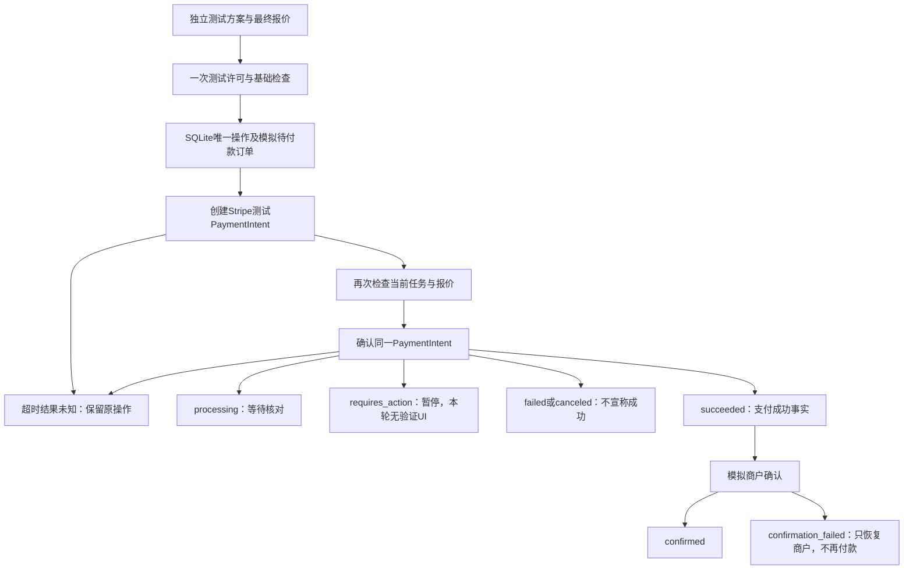

# 模拟商户订单与 Stripe 沙盒支付

> 当前购买规则已更新：主 Agent 购买必须有明确的有限授权；一次测试许可不能替代授权。旧浏览器独立沙盒付款入口已关闭。以下历史验收保留，最新接口和调试路径见 [有限授权与风控](limited-authorization.md)。

本轮是独立开发测试链路，不接真实 Shopping，不将 ShoppingStub 未知价格或普通 mock 推荐变成付款报价。商户为 DemoMerchantAdapter，商品不真实购买；Stripe 仅接受测试密钥和官方测试 PaymentMethod。本模块没有正式授权、风控、退款、物流或部署能力。

## 模块与替换接口

源码在 `services/purchase-execution/`：

| 文件 / 模块 | 职责 / 接口 |
|---|---|
| `fixture.ts` / SandboxPurchaseFixture | 生成服务器保存的独立测试任务和方案；固定测试乳液、SKU、1件、200 HKD 含运费预算 |
| `types.ts` | 本模块专属 Quote、Plan、Order、Operation 和各 Port；复用 canonical Requirement，不复制共享类型 |
| `demo-merchant.ts` / MerchantOrderPort | `quote(plan)`、`createPending(operationId, quote)`、`get(orderId)`、`confirm(orderId,paymentId)`；独立最终报价商品17000+运费1000=18000港仙，有效15分钟 |
| `gate.ts` / ExecutionGate | `check({mode,task,plan,quote,userId,expectedVersion,permitted,now})`；只返回 `sandbox_test_only`；production 没有正式策略时拒绝 |
| `stripe-sandbox.ts` / PaymentPort | `configured/configurationId`、`create(operation)`、`confirm(operation)`、`retrieve(paymentId)`、`verifyWebhook(raw,signature)`；输出脱敏 PaymentSnapshot，不返回 client_secret 或卡数据 |
| `repository.ts` | Node 24 `node:sqlite` 持久化、唯一约束、短事务、租约与旧执行者写入保护 |
| `service.ts` / PurchaseExecutionService | `createFixture/get/list/execute/reconcile/webhook`，确定性编排、任务版本复核、幂等恢复、商户确认 |
| `http.ts`、`runtime.ts` | 独立演示会话归属、同源校验、严格请求字段、原始 Webhook 验签、开发环境开关 |
| `components/sandbox-purchase-debug.tsx` | `/sandbox-purchase` 页面，沿用组件，无视觉重设计 |
| `tests/purchase-execution.test.mjs` | 可控支付替身、真实 SDK 本地签名校验、持久化及HTTP边界测试，无网络调用 |
| `scripts/check-stripe-sandbox.mjs` | 显式 `--execute` 的真实沙盒验收；配置缺失不发请求；重复运行恢复同一方案/操作 |

未来 Shopping 接入位置：替换 fixture 的方案来源，将有明确最终报价的**已保存**方案绑定到权威任务仓储的当前版本。现在使用独立 SQLite 测试任务，不从内存 Main Agent 复制一个可过期的授权快照，也没有向自然语言模型暴露支付工具。模型未来只能提出已保存 planId 的执行请求；用户归属、版本、测试许可/正式授权和金额始终由服务端决定。API 不接收金额、支付凭证、商户URL或可执行代码。

正式 ExecutionGate 接入位置：替换 `SandboxExecutionGate`，保留服务内归属、版本、幂等及结果关联校验，并明确设计正式模式启用流程。当前 runtime 非 development 返回404；service 的 production 执行/核对/通知路径同样拒绝。不把 `one_sandbox_test` 许可迁移成持续授权。

真实商户未来替换 `MerchantOrderPort`；需自行实现幂等的外部订单创建/确认，service 保存其本地订单投影。当前 Demo adapter 还使用同一 SQLite 数据库作为模拟商户账本，不访问任何商户网站。

## API

`/api/sandbox-purchase/[action]`，全部响应 `Cache-Control:no-store`。

| 路径 | 请求 / 行为 |
|---|---|
| POST session | `{}`；发放 HttpOnly、SameSite=Strict 演示cookie，仅在该API路径使用 |
| POST fixture | `{requestId}`；服务器固定测试数据，持久化去重，不接受价格或商户 |
| GET state | 可选 `?planId=...`；只读SQLite。省略返回该归属最近30份方案，不调用Stripe/商户/搜索 |
| POST execute | `{planId,expectedVersion,requestId,testPermission:true}`；运行或恢复同一个购买操作 |
| POST reconcile | `{planId}`；仅查询已有Stripe对象、更新状态或恢复模拟商户确认；不创建/确认PaymentIntent |
| POST webhook | 原始JSON + `Stripe-Signature`，SDK验签，不使用会话cookie或浏览器success参数 |

execute 示例（ID从服务器创建的方案取得）：

```json
{"planId":"<server-plan-id>","expectedVersion":1,"requestId":"<unique-request-id>","testPermission":true}
```

get/execute/reconcile 返回 `{view:{task,plan,quote,operation,order,events,...}}`。支付状态在 operation，商户状态在 order；它们不会合成一个模糊的“购买成功”。已持久化操作中的异常通过 `operation.errorCode` 展示；接口权限/版本/字段错误有明确HTTP错误码。只有Stripe响应/经验签通知后重新查询的对象可以改变支付状态。页面 URL、跳转或 `success=true` 没有支付效果。

## 持久化与执行保护

数据库 `.data/sandbox-purchase.sqlite`（WAL、synchronous=FULL、foreign_keys=ON），`.data/` 已忽略；原 `.env.local` 未改动。要求 Node >=24.13.0，内置 SQLite 在此版本仍为 experimental，限本地开发。只初始化独立 `sandbox_*` 表，不迁移其他组数据。

表：sessions（只保存随机cookie的SHA256）、tasks、plans及不可变报价、fixture_requests、operations、orders、events、webhooks。演示身份不是生产认证；浏览器cookie在、数据库在即可重启恢复。

唯一约束：fixture `(owner,request_id)`，plan `(task_id,version)`，operation `plan_id` 及 `(task_id,version)`，Stripe payment_id，merchant order operation_id，webhook event_id。一次测试许可、服务器报价、create/confirm幂等键、首次调用时间在发出请求前持久化；换requestId不能生成同一方案的第二次支付。

短 `BEGIN IMMEDIATE` 事务不跨网络await。执行者使用持久化60秒租约，写入须匹配token且未过期；不同连接/进程共享唯一约束，旧执行者不能覆盖接管者。Stripe SDK请求超时10秒、禁用自动网络重试；编排外部调用12秒上限，没有无限循环。模拟商户接口本地同步落盘；未来网络商户需实现自身取消与幂等语义。

执行前校验：归属、purchase意图（compare禁止）、服务器任务/Requirement/plan版本、测试来源和商户、商品/SKU/数量、HKD币种、整数已知报价及运费和总额、一致预算口径、报价有效期、一次测试许可。支付测试额另限制不超过200 HKD。创建后、确认PaymentIntent前重新读取任务并复核，避免异步期间修改任务后继续支付。

创建超时保持原操作 unknown：有效报价和恢复窗口内重放原create参数/幂等键，不新建购买操作。若已有Stripe ID，先retrieve，再决定是否允许原confirm。确认超时不假定失败；查询当前对象，已成功时只处理商户。密钥/API版本/固定PaymentMethod的哈希绑定首次请求配置，变化时暂停，避免换Stripe账户后重放成新支付（密钥本身不写数据库）。

Stripe幂等键可能在24小时后被清理，因此本模块保守限制23小时重放窗口。报价过期、任务变化或窗口已过均禁止新的支付POST；保留原操作供查询/已验签通知核对。无ID且无法安全重放时需要人工在原Stripe沙盒核对，本轮不自动重建/退款。不要删除SQLite或新建方案来掩盖未知支付结果。

## 状态流程



支付 `succeeded` 是不可回退状态。通知按 event_id 去重，接收后先保存pending，再查当前Stripe对象，检查livemode、金额、币种、操作/订单/方案metadata，不能用通知的created时间排序，也不直接应用通知快照。并发处理或网络失败返回503使Stripe重投；已完成事件直接200。商户确认失败独立记录，可显式reconcile恢复；本轮没有后台调度器，持久化pending事件依赖Stripe重投或人工恢复。

## Stripe 官方协议与配置

2026-10-03核对官方文档：

- [测试指南](https://docs.stripe.com/testing)：只用测试API密钥；官方 `pm_card_visa`，不用真实卡号或用户支付凭证。
- [创建PaymentIntent](https://docs.stripe.com/api/payment_intents/create)、[确认](https://docs.stripe.com/api/payment_intents/confirm)、[查询](https://docs.stripe.com/api/payment_intents/retrieve)：官方Stripe Node SDK 23.0.0，固定API版本 `2026-09-30.endive`。当前新版参数是 `allowed_payment_method_types:["card"]`，不是旧版创建参数名。创建confirm:false，保存ID后确认，automatic capture，仅卡路线。
- [幂等](https://docs.stripe.com/api/idempotent_requests)：稳定参数/键，持久化恢复；不依赖Stripe无限保存键。
- [Webhook](https://docs.stripe.com/webhooks)、[签名](https://docs.stripe.com/webhooks/signature)：使用原始body及SDK验签（300秒容差），事件去重；不假设有序。只处理六种payment_intent snapshot事件，其他事件忽略。

客户端拿不到密钥或client_secret。服务器仅从环境读取 `STRIPE_SECRET_KEY` / `STRIPE_WEBHOOK_SECRET`；SDK默认Stripe API地址不可从客户端替换。拒绝非 `sk_test_` 密钥，并验证所有使用的PaymentIntent/事件 `livemode:false`。固定测试支付方法在服务器源码配置，前端和模型没有选择凭证参数。

配置步骤（本轮未自动登录Stripe或改动密钥文件）：

1. 使用Stripe Dashboard的 **Sandbox**，获取该沙盒的测试secret key。在项目 `.env.local` **追加** STRIPE_SECRET_KEY，保留已有LLM配置；不要提交或贴到聊天。
2. 按官方文档在本机配置Stripe CLI，登录同一个沙盒账户，启动snapshot事件转发：

   ```sh
   stripe listen --forward-to localhost:3000/api/sandbox-purchase/webhook
   ```

3. 将该监听器返回的签名secret写入 `.env.local` 的 STRIPE_WEBHOOK_SECRET。CLI签名secret和Dashboard端点secret不同，不能混用。Dashboard端点如另行配置，应选相应snapshot事件及适配的版本；本轮不部署端点。
4. 在项目目录使用Node24，`npm install`（依赖已安装）后 `npm run dev`；环境变量修改后重启。打开 `/sandbox-purchase`，创建测试方案，确认报价，勾选一次测试许可，点击“运行沙盒购买”。
5. 查看Stripe沙盒中的pi对象、页面paymentStatus及模拟order.status；用“只读刷新”读本地状态，或“核对Stripe/恢复商户确认”显式恢复。requires_action需要验证时本轮暂停，不展示完成。
6. CLI真实验收：`node scripts/check-stripe-sandbox.mjs` 只检查配置；加 `--execute` 才运行。固定持久化fixture请求ID，重复脚本执行恢复同一操作。结果写入忽略的 `.data/stripe-sandbox-acceptance.json`，不会输出密钥/鉴权头。脚本的支付API成功**不等于Webhook投递已验证**；该记录始终将 webhookDeliveryVerified 标为false，需另检查监听器/端点和持久化事件。

## 本轮实际验收

- 可控替身覆盖：成功、拒付、requires_action、processing/canceled、创建/确认超时未知、迟到响应、换requestId和并发、跨SQLite连接、进程仓储重开、报价过期、超预算、币种/数量/SKU/商户异常、错误归属、compare/旧版本、确认前版本或意图变化、支付成功但商户确认失败、配置变化、幂等窗口、租约失效、重复及乱序/并发通知、未知ID通知恢复。
- 官方SDK本地测试：合法/篡改/过期Webhook签名、livemode拒绝、测试PaymentMethod/参数/幂等键、SDK拒付异常字段。**这些是本地签名和受控客户端替身，不是Stripe服务器返回。**
- 浏览器实测：创建独立测试报价、勾选测试许可、缺配置时保存一份模拟待付款订单，paymentStatus=not_started、STRIPE_NOT_CONFIGURED、没有Stripe ID；页面重载后恢复同一operation/order及许可。截图 `sandbox-purchase-acceptance.png`。
- `.env.local` 两个Stripe变量均未配置。真实验收脚本返回STRIPE_NOT_CONFIGURED，没有向Stripe发送支付请求。因此真实沙盒支付、真实Webhook投递尚未验证，不宣称成功。

最终 `npm test` 119/119通过（原88项 + 本轮31项）；`npm run lint` 无错误或警告；`git diff --check` 通过。既有 Agent B `lib/agent-b/index.ts:564` TS2366继续保留；未改Shopping模块或关闭类型检查。默认Turbopack构建仍受既有端口绑定EPERM限制；Webpack编译可通过，后续类型检查在Agent B处停止。发现的4份重复 `.next/types/* 2.ts` 自动生成文件已移到 `/var/folders/rh/2t33dgxj6zx4kq4sfly625g40000gn/T/deepsleep-generated-type-backup-5vo1jxnb` 保留，未改tsconfig排除有效源文件。
